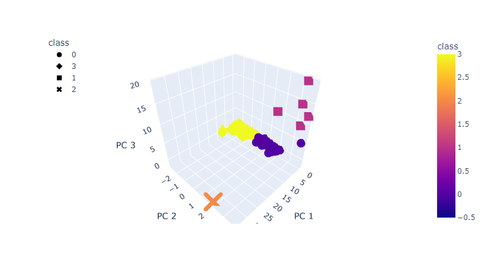
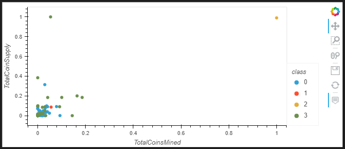
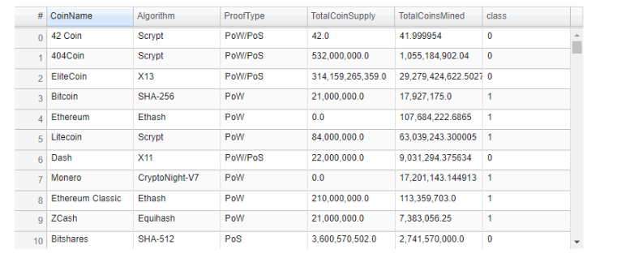

# Cryptocurrencies

# Overview

The purpose of this repository is to explore unsupervised machine learning on cryptocurrency data to discover patterns within the dataset.

## Results

### Deliverable 1

#### Processing Data

Data must be processed before using an unsupervised machine learning model in order to properly fit the model.  Starting with data selection, we decide what data is missing, duplicated, or erroneous to drop the values before proceeding with the clean dataset.

For this dataset, that means dripping the "IsTrading" column, null rows, and coins that are not being mined.

### Deliverable 2

#### Reducing Data Dimensions Using PCA

To avoid overfitting our model, we must use PCA to reduce the number of features.

PCA is a statistical technique to speed up machine learning algorithms when the number of input features (or dimensions) is too high.

First, we must standardize these features by using the StandardScaler library. Once the data has been standardized, we can use PCA to reduce the number of features (argument of n_components) getting a smaller set of dimensions called principal components. These new components are new main dimensions of variation that contain most of the information in the original dataset.

Then using the explained variance ratio, we can attribute each principal component.

In this instance the first principal component contains 72.77% of the variance and the second contains 23.03%. They contain 95.80% of the information in total.

### Deliverable 3

#### Clustering Cryptocurrencies Using K-means

Clustering is a form of unsupervised machine learning in which the computer groups our features into fewer composite feature clusters. The K-means is an algorithm that identifies the best number of clusters to use in a model (an elbow curve graph can help visualize this).

A new data frame was created based on the crypto_df using the predictions made by our model.

### Deliverable 4

#### Visualizing Cryptocurrencies Results

This first image is a 3D graph to represent the three principal components. This graph indicates cryptocurrency is clustered in 4 groups with similar characteristics.

A 2D graph can be used to show Total Coins Mined vs. Total Coin Supply.  This graph shows a potential correlation between these components.

The hvplot library also features interactive tables that can display our new df in a tabular fasion. The table can be sorted in ascending or descending order.
